<!-- Animated black & white coding-octopus banner (renders + animates on GitHub) -->

  

  
  

<h3 align="center">
  
</h3>

---

### 🐙 About me

AI engineer with strong foundations across **machine learning, deep learning, and LLM systems**, focused on **building and shipping** end-to-end products — from model development to live deployment. I like problems where correctness and honesty actually matter: leakage-safe evaluation, grounded generation, and agentic systems that ship to real users.

- 🔭 Building **agentic AI** and **RAG** systems on FastAPI + PostgreSQL, deployed on AWS
- 🧪 Sole author of RL research **under review at SN Computer Science (Springer Nature)**
- 🎯 Interested in Applied ML, Agentic AI, and AI systems that survive real scrutiny
- 📫 **anzarsk098@gmail.com**

---

### 🚀 Featured projects

| Project | What it is |
|---|---|
| 🧠 **[AEGIS](https://github.com/anzr101/aegis)** | Multi-agent campaign intelligence — 5 Claude agents in a fan-out/fan-in asyncio DAG, Pydantic-validated outputs, SSE streaming, FastAPI + PostgreSQL. *Shipped as a paid client system.* |
| 🌿 **[FloraAI](https://github.com/anzr101/flora-ai)** | 4-service plant-diagnosis platform fusing computer vision (MobileNetV3 CNN), a leakage-safe HistGBM + SHAP model, and a Claude RAG layer behind an orchestration gateway. |
| 📚 **[Veris](https://github.com/anzr101/veris)** | Citation-grounded research engine over arXiv — hybrid retrieval (pgvector + BM25, RRF), claim verification, cost-tiered LLM routing, ports-and-adapters, offline test suite. |
| 📈 **[MarketLab](https://github.com/anzr101/market_lab101)** | Honest NSE return predictor — exposes the classic 0.99 R² price-leakage trap, rebuilds on strict walk-forward returns, and adds an adaptive risk gate with the lowest drawdown of 5 sizing rules. **[Live »](https://dhibs30c09by5.cloudfront.net/)** |

---

### 🛠️ Tech stack

 

-2088FF?style=flat-square&logo=githubactions&logoColor=white)

